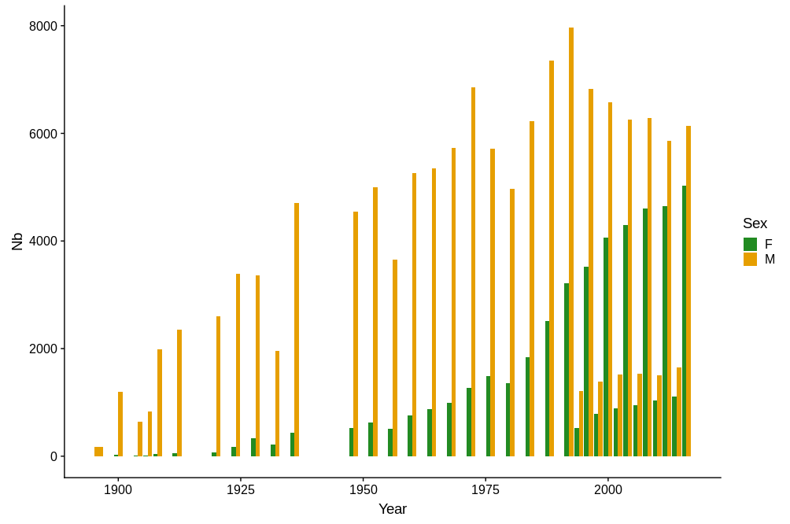
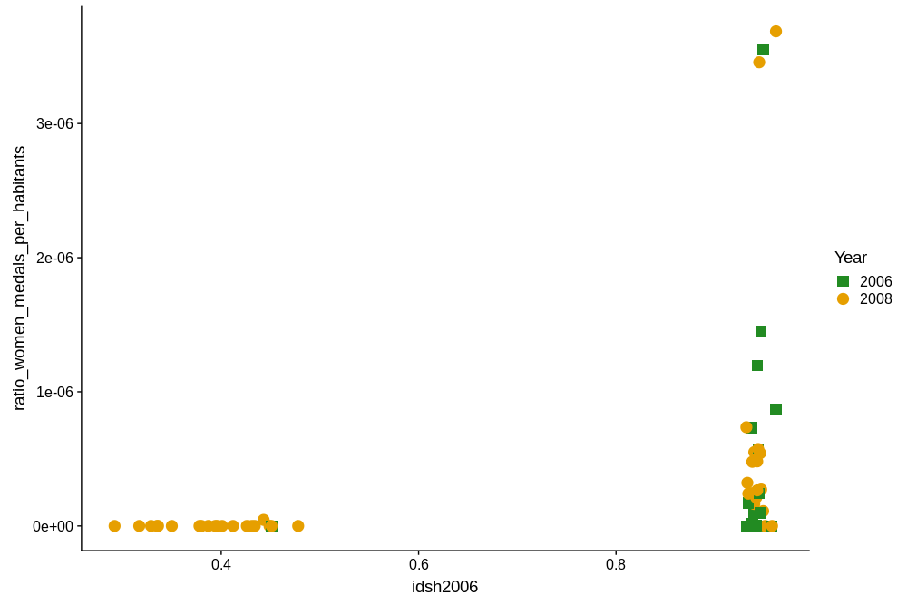
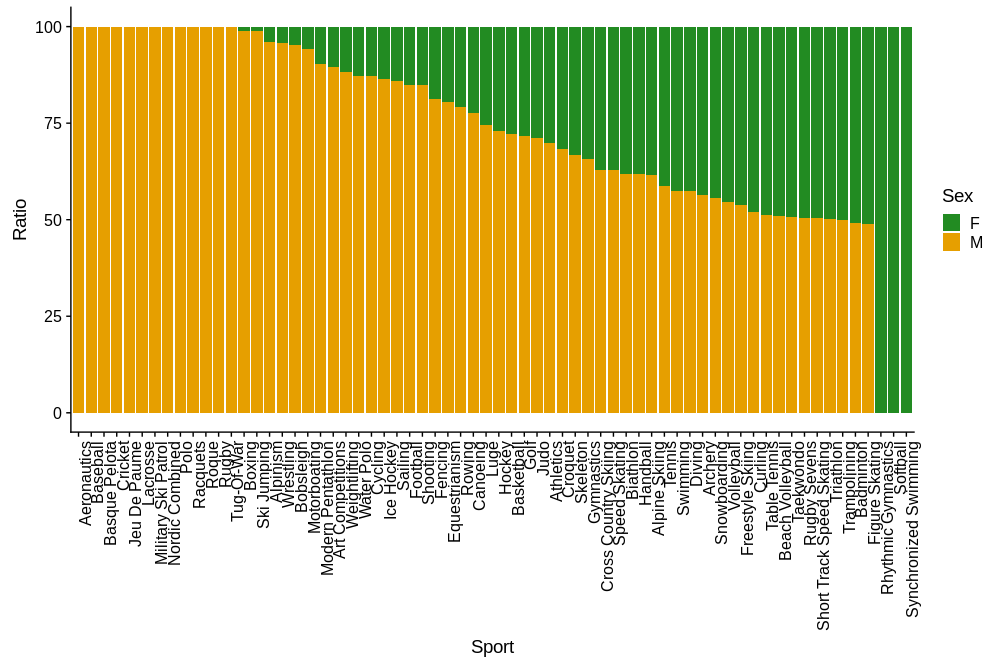
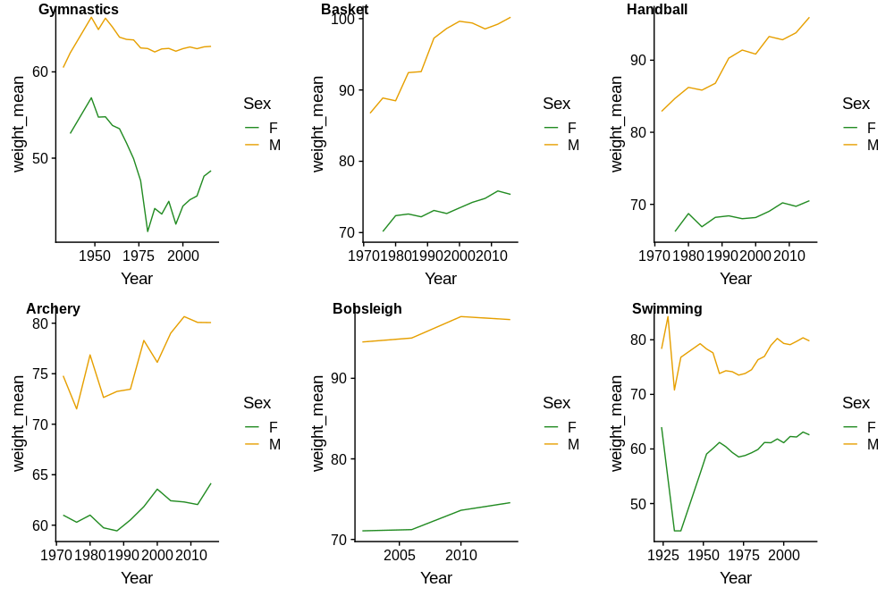
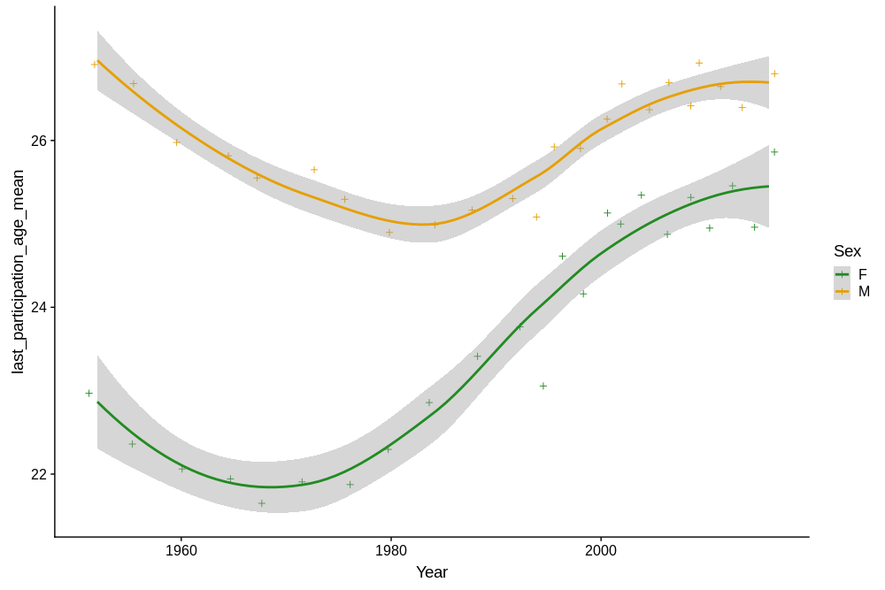

# Analyse de données : étude de la condition de la femme au travers des JO

Analyse d'un Dataset issu de l'Open Data avec R afin d'étudier la place de la femme dans la société au travers des résultats des Jeux Olympiques.

*INSA Toulouse - 5e année ISS*

*ALOÏSI Axelle & CHASSERAT Laurent*

